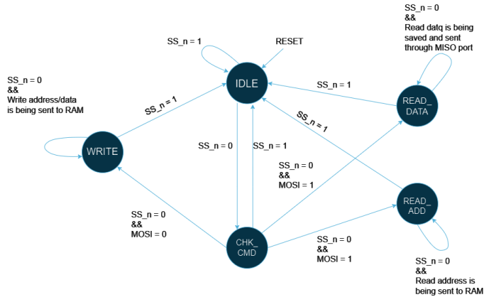
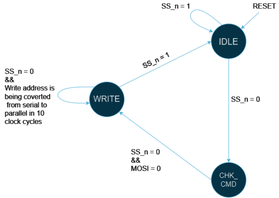
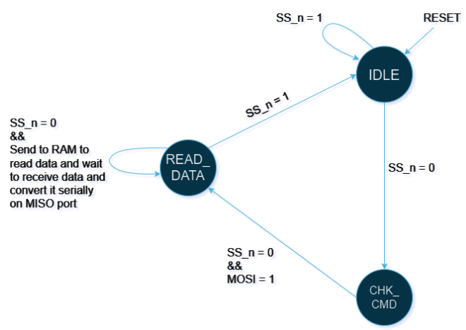

# SPI Slave With Single Port Memory

## Overview
This repository contains the implementation of an SPI (Serial Peripheral Interface) communication protocol. The project includes the design and code for an SPI Slave, a single-port synchronous RAM, and an SPI Wrapper that connects the RAM and SPI Slave.

## SPI Communication Protocol
SPI is a synchronous serial communication protocol used for short-distance communication, primarily in embedded systems. It enables a master device to communicate with one or more slave devices at high speeds using a minimal number of I/O pins. The protocol uses four main signals:
- **MOSI (Master Out Slave In)**: Carries data from the master to the slave.
- **MISO (Master In Slave Out)**: Carries data from the slave to the master.
- **SCLK (Serial Clock)**: Clock signal generated by the master to synchronize data transmission.
- **SS/CS (Slave Select/Chip Select)**: Used by the master to select which slave to communicate with.

## Project Components
1. **SPI_SLAVE.v**: Implements the SPI Slave interface.
   - **Ports**:

     | Name     | Type   | Size  | Description             |
     |----------|--------|-------|-------------------------|
     | MOSI     | Input  | 1 bit | Master Out Slave In     |
     | tx_valid | Input  | 1 bit | Control for Input Data  |
     | tx_data  | Input  | 8 bits| Input Data for SPI Slave|
     | rst_n    | Input  | 1 bit | Active low asynchronous reset |
     | clk      | Input  | 1 bit | Clock                   |
     | MISO     | Output | 1 bit | Data Output             |
     | rx_valid | Output | 1 bit | Control for Output Data |
     | rx_data  | Output | 10 bits| Output Data for SPI Slave |

2. **RAM.v**: Implements a single-port asynchronous RAM.
   - **Parameters**:
     - `MEM_DEPTH`: Memory depth, default is 256.
     - `ADDR_SIZE`: Address size, default is 8 bits.
   - **Ports**:

     | Name     | Type   | Size  | Description             |
     |----------|--------|-------|-------------------------|
     | din      | Input  | 10 bits| Data Input             |
     | clk      | Input  | 1 bit | Clock                   |
     | rst_n    | Input  | 1 bit | Active low asynchronous reset |
     | rx_valid | Input  | 1 bit | If HIGH: accept din[7:0] to save the write/read address internally or write a memory word depending on the most significant 2 bits din[9:8] |
     | dout     | Output | 8 bits| Data Output             |
     | tx_valid | Output | 1 bit | Whenever the command is memory read the tx_valid should be High |

3. **SPI_Wrapper.v**: Connects the SPI Slave and RAM modules.
   - Handles the communication and data transfer between the SPI Slave and RAM.

## SPI Communication States

### 1. Write Address
1. Master starts the write command by sending the write address value, `rx_data[9:8] = din[9:8] = 2'b00`.
2. `SS_n = 0` to signal the SPI Slave that the master will begin communication.
3. SPI Slave checks the first received bit on the `MOSI` port which is a control bit to determine the operation (write in this case). The SPI Slave then expects to receive 10 bits, with the first 2 bits being "00" and the next 8 bits being the write address.
4. Data is converted from serial (MOSI) to parallel after writing to the `rx_data[9:0]` bus.
5. `rx_valid` will be HIGH (for one clock cycle) to inform the RAM to expect data on the `din` bus.
6. `din` takes the value of `rx_data`.
7. RAM checks `din[9:8]` and finds they hold "00".
8. RAM stores `din[7:0]` in the internal write address bus.
9. `SS_n = 1` to end communication from the master side.

   

### 2. Write Data
1. Master continues the write command by sending the write data value, `rx_data[9:8] = din[9:8] = 2'b01`.
2. `SS_n = 0` to signal the SPI Slave that the master will begin communication.
3. SPI Slave checks the first received bit on the `MOSI` port which is a control bit to determine the operation (write in this case). The SPI Slave then expects to receive 10 more bits, with the first 2 bits being "01" and the next 8 bits being the write data.
4. Data is converted from serial (MOSI) to parallel after writing to the `rx_data[9:0]` bus.
5. `rx_valid` will be HIGH (for one clock cycle) to inform the RAM to expect data on the `din` bus.
6. `din` takes the value of `rx_data`.
7. RAM checks `din[9:8]` and finds they hold "01".
8. RAM stores `din[7:0]` in the RAM with the previously held write address.
9. `SS_n = 1` to end communication from the master side.

   

### 3. Read Address
1. Master starts the read command by sending the read address value, `rx_data[9:8] = din[9:8] = 2'b10`.
2. `SS_n = 0` to signal the SPI Slave that the master will begin communication.
3. SPI Slave checks the first received bit on the `MOSI` port which is a control bit to determine the operation (read in this case). The SPI Slave then expects to receive 10 bits, with the first 2 bits being "10" and the next 8 bits being the read address.
4. Data is converted from serial (MOSI) to parallel after writing to the `rx_data[9:0]` bus.
5. `rx_valid` will be HIGH (for one clock cycle) to inform the RAM to expect data on the `din` bus.
6. `din` takes the value of `rx_data`.
7. RAM checks `din[9:8]` and finds they hold "10".
8. RAM stores `din[7:0]` in the internal read address bus.
9. `SS_n = 1` to end communication from the master side.

   

### 4. Read Data
1. Master continues the read command by sending the read data command, `rx_data[9:8] = din[9:8] = 2'b11`.
2. `SS_n = 0` to signal the SPI Slave that the master will begin communication.
3. SPI Slave checks the first received bit on the `MOSI` port which is a control bit to determine the operation (read in this case). The SPI Slave then expects to receive 10 bits, with the first 2 bits being "11" and the next 8 bits being dummy data, which will be ignored as the master waits for data from the slave.
4. Data is converted from serial (MOSI) to parallel after writing to the `rx_data[9:0]` bus.
5. `din` takes the value of `rx_data`.
6. RAM reads `din[9:8]` and finds they hold "11".
7. RAM reads from the memory with the previously held read address.
8. RAM asserts `tx_valid` to inform the slave that data output is ready.
9. Slave reads `tx_data` and converts it to serial output data on the `MISO` port.
10. `tx_valid` will be HIGH for 9 clock cycles (1+8).
11. `SS_n = 1` to end communication from the master side after receiving data for 8 clock cycles.

   

## Additional Notes
- A `.do` file is included to simplify the simulation setup.
- The design code is extensively commented to improve readability and understanding.
- A comprehensive testbench (`SPI_Wrapper_tb.v`) is provided to test various scenarios including writing and reading data.

## Repository Structure

- Constraints_File
- DO_File
- Documentation_PDF
- Images
- Netlist_File
- RTL_Code
- Run_file
- Schematics
- Simulation
- README.md

## How to Use
1. Clone the repository: git clone https://github.com/MohamedHussein27/SPI_Project.git
2. Open the project in your preferred Verilog simulator (e.g., ModelSim or QuestaSim).
3. Use the provided '.do' file to run the simulations.
4. Refer to the comments in the code for detailed explanations of the functionality and flow.

This project provides a thorough implementation of the SPI protocol, including the SPI Slave, RAM, and a Wrapper module, making it easy to understand and simulate SPI communication.

## Eng. Kareem Waseem
- This is the final project of **Digital Design using Verilog and FPGA flow using Vivado Version 13 Diploma** by Eng. **Kareem Waseem** (Digital Verification Team Lead at Si-Vision), I highly recommend this diploma for everyone interested or working in Digital Design.
- [Eng. Kareem's LinkedIn](https://www.linkedin.com/in/kareem-waseem/).
- For updates check out the [facebook group](https://www.facebook.com/share/g/15EpEScjx3/).

## Contact Me!
- [Email](mailto:Mohamed_Hussein2100924@outlook.com)
- [WhatsApp](https://wa.me/+2001097685797)
- [LinkedIn](https://www.linkedin.com/in/mohamed-hussein-274337231)
